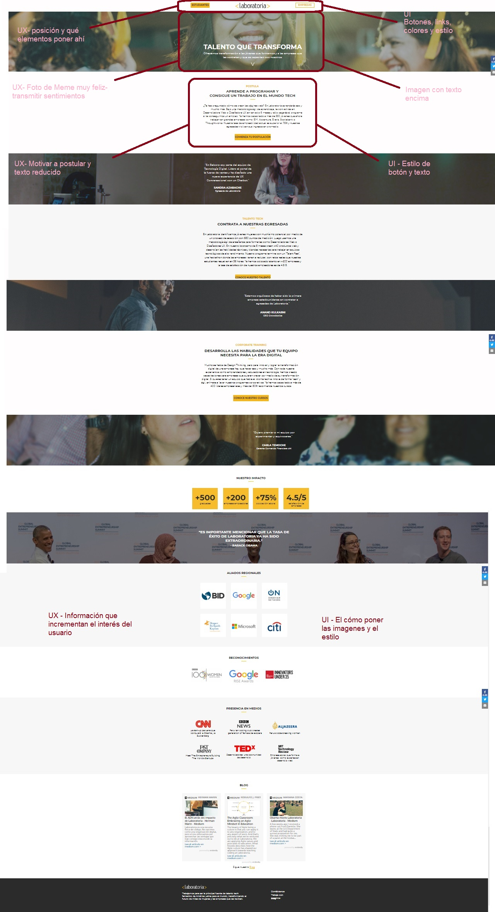
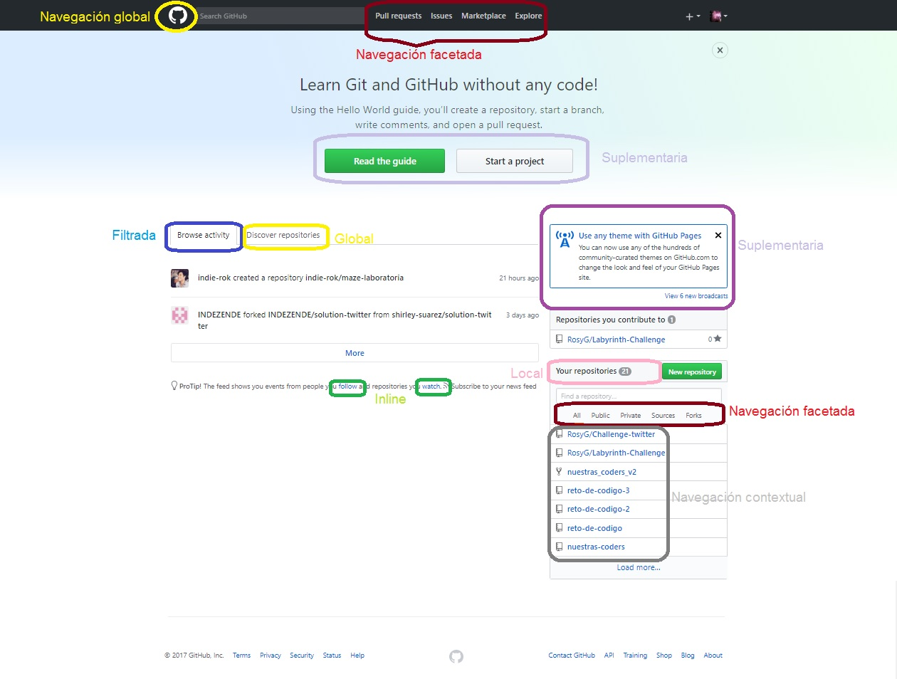
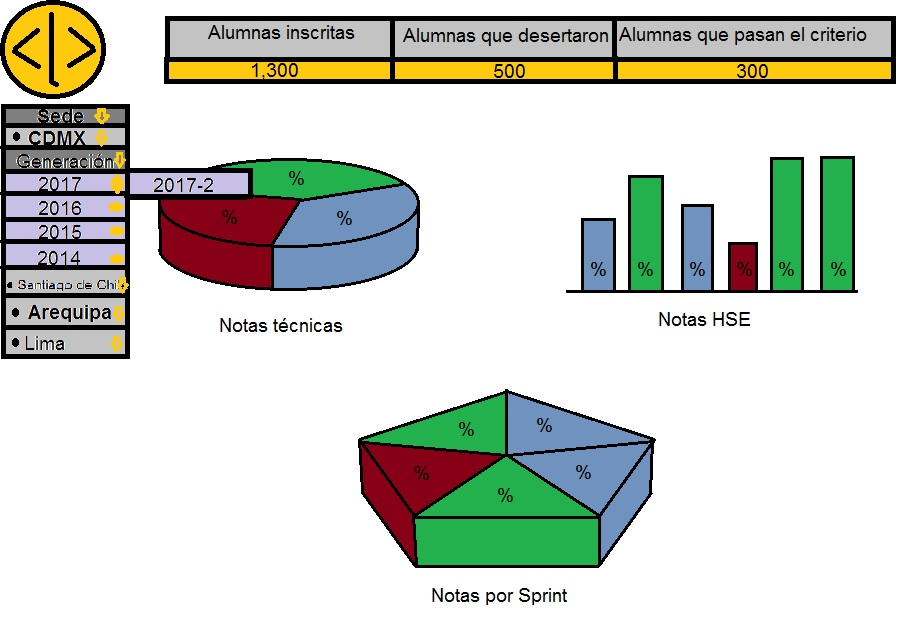

### 1. Partes que conforman el UX y partes que conforman el UI de la página de [Laboratoria](http://www.laboratoria.la "Laboratoria").

#### *User Experience*
El **UX** se encarga de ver las necesidades del usuario así como la simplicidad a través de la navegación para que el usuario se sienta a gusto con la página y/o aplicación y ésto lo logramos por medio de la psique, el porqué, el dónde y el cómo se colocan los elementos, jugar con la psicología del color. Usar imagenes que transmiten sensaciones e iconos para poder comunicar más cosas pero con menos letras.

#### *User Interface*
El **UI** se encarga del aspecto físico (estilo) del sitio por medio de botones, enlaces, imagenes, texto con una imagen de background, links, efectos hover, tipografía, los diferentes eventos, el que siempre se vean las redes sociales pero en base a lo que el *UX* indica.

### 2. Elementos de navegación de [Github](https://github.com "Github").

En la página de [*Github*](https://github.com "Github") podemos ver que hay diferentes tipos de navegación y unos se repiten en el inicio de la página.

En la parte que aparece por default al entrar a la página se puede ver un icono para una **navegación global**, búsqueda de elementos conocidos, **navegación facetada**, así como la parte para loggearse o registrarse. Seguido está la **navegación suplementaria** la cual facilita el uso de la página para los que apenas se registraron y puede verse más de una vez.

También encontramos **navegación filtrada** que muestra la actividad de las personas con las que tienes contacto a través de la página o puedes hacer una búsqueda de elementos no conocidos la cual viene siendo la de descubrir repositorios.

La página nos da la opción para poder navegar sólo entre nuestros repositorios o sea, **navegación local**. Vienen links que nos redireccionan a otras páginas y viene siendo **navegación inline**.

Más abajo podemos encontrar una sección donde nos muestran elementos parecidos a los nuestros y eso es **navegación contextual**.

### 3. Sketch para la herramienta del dashboard de Laboratoria  

